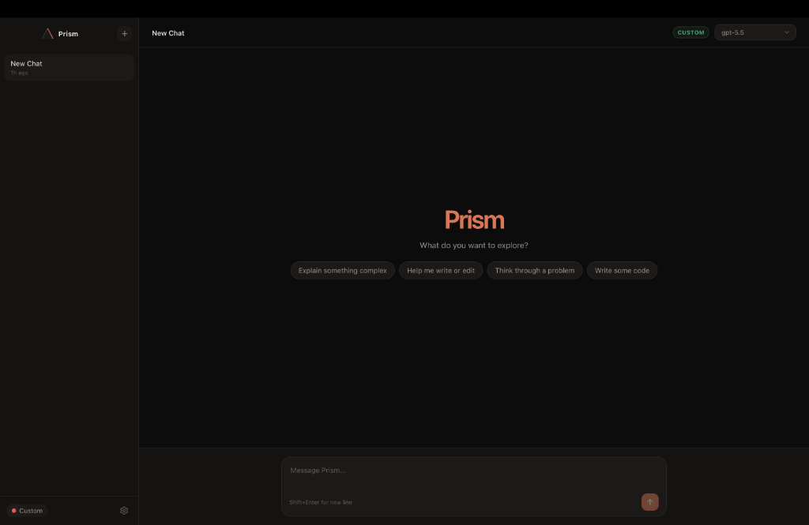

<p align="center">
  
</p>

<h1 align="center">Prism</h1>

<p align="center">
  <strong>Every model. One interface.</strong>
</p>

<p align="center">
  A cross-platform AI desktop chat client that works with any LLM provider,<br>
  any local model, and any OpenAI-compatible API — all from a single, persistent interface.
</p>

<p align="center">
  <a href="LICENSE"></a>
  
  
  <a href="CONTRIBUTING.md"></a>
</p>

<p align="center">
  
</p>

---

## Why Prism?

Most AI chat apps lock you into a single provider. Prism doesn't. Add API keys for as many providers as you want, switch between them mid-conversation, or point Prism at your own local Ollama server. Your chats, your keys, your machine — nothing leaves your device.

---

## Features

| Feature | Details |
|---------|---------|
| **Multi-provider** | 12 providers supported out of the box — OpenAI, Anthropic, Google, Groq, Cerebras, Fireworks, DeepSeek, Moonshot, Qwen, Mistral, xAI, OpenRouter |
| **Conversational Mode** | Seamless voice chats with real-time audio transcription powered by local `nodejs-whisper` (or optionally accelerated via Groq API) |
| **Local Text-to-Speech** | Fully offline, multi-threaded TTS streaming via `kokoro-js` and ONNX WASM — zero cloud latency |
| **Cross-chat Memory** | Automatically extracts and remembers user preferences across all conversations |
| **Custom endpoints** | Any OpenAI-compatible server — Ollama, LM Studio, vLLM, Jan.ai, LiteLLM, Azure |
| **Live model discovery** | Fetches available models directly from provider APIs and `/v1/models` |
| **Persistent history** | All chats stored locally in SQLite — no cloud, no sync, no telemetry |
| **Streaming** | Real-time token streaming with live markdown rendering |
| **Code highlighting** | Syntax-highlighted code blocks with one-click copy |
| **Two-step model picker** | Choose provider first, then model — or type any custom model name |
| **Keyboard shortcuts** | `⌘N` new chat · `⌘,` settings · `Esc` close |
| **Warm dark theme** | `#0D0C0C` background, `#D97757` accent |

---

## Supported Providers

### Direct API Mode

Bring your own API keys. Models are shown automatically when a key is saved.

| Category | Providers |
|----------|-----------|
| **Major** | OpenAI · Anthropic · Google Gemini |
| **Fast inference** | Groq · Cerebras · Fireworks AI |
| **Open-source** | DeepSeek · Moonshot (Kimi) · Qwen · Mistral · xAI (Grok) |
| **Aggregators** | OpenRouter |

Click the **⟳** button in the top bar to fetch the live model list from each provider's API — including any new models added after release.

### Custom Endpoint Mode

Point Prism at any OpenAI-compatible URL. Models are auto-detected from `/v1/models`.

| Server | Default URL |
|--------|-------------|
| Ollama | `http://localhost:11434/v1` |
| LM Studio | `http://localhost:1234/v1` |
| Jan.ai | `http://localhost:1337/v1` |
| vLLM | `http://localhost:8000/v1` |
| Any OpenAI-compatible server | your URL |

---

## Tech Stack

| Layer | Technology |
|-------|------------|
| Shell | Electron 41 + electron-vite |
| UI | React 18 + TypeScript |
| Styling | Tailwind CSS |
| State | Zustand |
| Storage | better-sqlite3 (local SQLite) |
| Voice & Audio | kokoro-js (TTS) · nodejs-whisper (STT) · onnxruntime-web |
| Rendering | react-markdown + rehype-highlight |
| LLM SDKs | OpenAI SDK · Anthropic SDK · Google Generative AI SDK |

---

## Pre-built Downloads

Don't want to build from source? Grab the latest installer for your OS from the [GitHub Releases](https://github.com/IterationLabz/prism/releases) page.

---

## Quick Start

### Prerequisites

Make sure you have the following installed:

```bash
node --version   # Must be 18.0.0 or higher
npm --version    # Must be 9.0.0 or higher
git --version    # Any recent version
```

> **Important:** Prism relies on native C/C++ Node modules (`better-sqlite3` and `nodejs-whisper`). To build from source, you **must** have native build tools installed on your system:
> - **macOS**: `xcode-select --install`
> - **Windows**: Install Visual Studio Build Tools with the "Desktop development with C++" workload
> - **Linux**: `sudo apt install build-essential python3`

### 1. Clone & Install

```bash
git clone https://github.com/IterationLabz/prism.git
cd prism
npm install
```

### 2. Run in Development

```bash
npm run dev
```

This launches Prism with hot-reload enabled. On first launch, you'll see an onboarding screen where you can choose between Direct API mode (enter your own API keys) or Custom Endpoint mode (point to a local server like Ollama). Changes to renderer code update instantly; main process changes trigger an automatic restart.

### 3. Build for Production

```bash
npm run build
```

This compiles the main process, preload script, and renderer into optimized bundles in the `out/` directory.

### 4. Package for Your OS

```bash
npm run package
```

This runs a production build and then packages it into an installable file for your current operating system. The output appears in `dist/`.

Platform-specific packaging commands are also available:

```bash
npm run package:mac     # macOS (.dmg for both Apple Silicon and Intel)
npm run package:win     # Windows (.exe NSIS installer)
npm run package:linux   # Linux (.AppImage)
```

> **Note on Windows Releases:** Automated GitHub Action releases currently skip Windows packaging due to CI file-size memory constraints during ASAR bundling of local TTS models. If you need Prism on Windows, simply clone the repo and run `npm run package:win` locally on your machine—it will compile perfectly.

> **Note:** You can only package for the OS you're running on. To package for a different OS, run the package command on that OS.

### 5. Install the Packaged App

<details>
<summary><strong>macOS</strong></summary>

1. Open the `.dmg` file from `dist/`
2. Drag **Prism** to your **Applications** folder
3. On first launch, macOS will block it because it's unsigned. To bypass:
   - **Right-click** (or Control-click) the app → **Open** → click **Open** in the dialog
   - Or run this command in Terminal:
     ```bash
     xattr -cr /Applications/Prism.app
     ```
4. After the first open, it will launch normally going forward

</details>

<details>
<summary><strong>Windows</strong></summary>

1. Run the `Prism Setup x.x.x.exe` installer from `dist/`
2. If Windows SmartScreen blocks it:
   - Click **More info**
   - Click **Run anyway**
3. Choose your installation directory and complete the setup

</details>

<details>
<summary><strong>Linux</strong></summary>

1. Make the AppImage executable:
   ```bash
   chmod +x Prism-x.x.x.AppImage
   ```
2. Run it:
   ```bash
   ./Prism-x.x.x.AppImage
   ```

</details>

---

## Architecture

```
src/
├── main/                 # Electron main process
│   ├── index.ts          # Window creation, app lifecycle
│   ├── db.ts             # SQLite via better-sqlite3
│   ├── ipc.ts            # IPC handlers (settings, chats, models)
│   └── llm.ts            # Provider routing, streaming, model fetching
├── preload.ts            # Context bridge (main ↔ renderer)
├── shared/
│   └── config.ts         # Shared types and defaults
└── renderer/
    └── src/
        ├── App.tsx
        ├── store.ts              # Zustand state
        ├── hooks/
        │   └── useEndpointModels.ts
        └── components/
            ├── TopBar.tsx        # Provider → model selector
            ├── SettingsModal.tsx  # Keys, endpoint, preferences
            ├── Sidebar.tsx       # Chat list
            ├── ChatWindow.tsx    # Messages + composer
            └── OnboardingModal.tsx
```

All API keys and chat data stay on your machine. The renderer never touches Node.js APIs directly — everything goes through IPC.

---

## Security

- API keys are stored in a local SQLite database in your OS user data directory
- Keys are sent only to the provider you choose — never to us or any third party
- Renderer runs with `contextIsolation: true` and `nodeIntegration: false`
- External URLs open via `shell.openExternal` through IPC — no renderer-side navigation

---

## Troubleshooting

<details>
<summary><strong>macOS: "developer cannot be verified" warning</strong></summary>

Prism is not signed with an Apple Developer certificate. On first launch, macOS will block it.

**Fix:** Right-click the app → **Open** → click **Open** in the confirmation dialog. Alternatively, run:

```bash
xattr -cr /Applications/Prism.app
```

This only needs to be done once.

</details>

<details>
<summary><strong>Models not loading in Custom Endpoint mode</strong></summary>

1. **Verify your server is running** — try `curl http://localhost:11434/v1/models` in your terminal
2. **Check the URL format** — it must end in `/v1` (e.g. `http://localhost:11434/v1`, not just `http://localhost:11434`)
3. **For Ollama** — make sure you've pulled at least one model: `ollama pull llama3`
4. **Fallback** — if auto-detection fails, use the "✏ Custom model…" option in the model dropdown and type the model name manually

</details>

<details>
<summary><strong>Ollama CORS errors</strong></summary>

If you see CORS-related errors in the console when connecting to Ollama:

```bash
OLLAMA_ORIGINS="*" ollama serve
```

Or set the environment variable permanently in your shell profile.

</details>

<details>
<summary><strong>Streaming seems to hang</strong></summary>

- **Check your API credits** — most providers return errors silently when credits are exhausted
- **Reasoning models take longer** — models like `o1`, `o3`, and `deepseek-reasoner` think before responding. Wait 10–30 seconds.
- **Check the terminal** — if you launched with `npm run dev`, main process errors appear in the terminal where you ran the command

</details>

<details>
<summary><strong>better-sqlite3 or nodejs-whisper native module errors</strong></summary>

If you see errors about `better-sqlite3` or `nodejs-whisper` failing to load native bindings after install:

```bash
npm run postinstall
```

If that doesn't work, ensure you have the native build tools installed (see Prerequisites), then do a clean reinstall:

```bash
rm -rf node_modules package-lock.json
npm install
```

</details>

---

## Roadmap

Planned features for upcoming releases:

- [x] Cross-chat memory (Autonomous background extraction)
- [x] Native Voice Mode (Local TTS & Speech-to-Text)
- [ ] System prompt presets (save and reuse custom system prompts)
- [ ] Image and file attachments for vision models
- [ ] Export chats as Markdown or JSON
- [ ] Light theme
- [ ] Auto-update via electron-updater
- [ ] Plugin system for custom providers

Have an idea? [Open an issue](https://github.com/IterationLabz/prism/issues) — we'd love to hear it.

---

## Acknowledgements

Prism is built on the shoulders of incredible open source projects:

- [Electron](https://www.electronjs.org/) — cross-platform desktop apps
- [React](https://react.dev/) — UI framework
- [Zustand](https://github.com/pmndrs/zustand) — lightweight state management
- [better-sqlite3](https://github.com/WiseLibs/better-sqlite3) — fast, synchronous SQLite
- [kokoro-js](https://github.com/huggingface/kokoro.js) — incredible offline TTS model
- [nodejs-whisper](https://github.com/chengazhen/nodejs-whisper) — local STT transcription
- [react-markdown](https://github.com/remarkjs/react-markdown) + [rehype-highlight](https://github.com/rehypejs/rehype-highlight) — markdown rendering with syntax highlighting
- [electron-vite](https://electron-vite.org/) — next-gen build tooling for Electron
- [Lucide](https://lucide.dev/) — beautiful icon set

Thanks to OpenAI, Anthropic, Google, and all the model providers whose APIs make Prism possible.

---

## Contributing

We welcome contributions! See [CONTRIBUTING.md](CONTRIBUTING.md) for guidelines on development setup, code style, and submitting pull requests.

---

## License

MIT © Shubh Arya and [Iteration Labz](https://github.com/IterationLabz)
